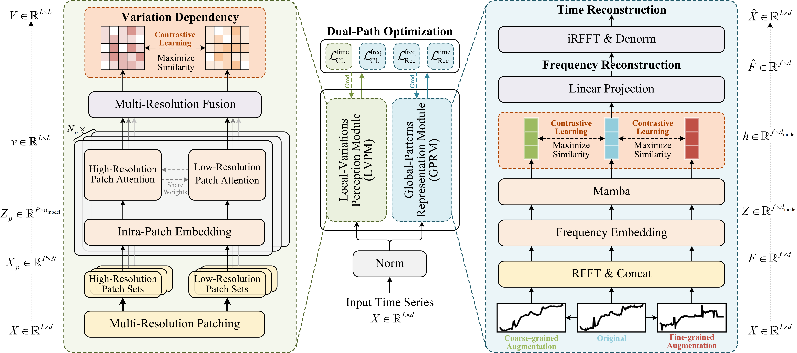
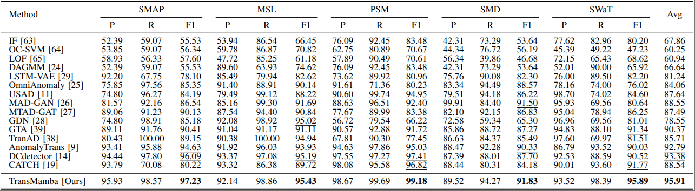
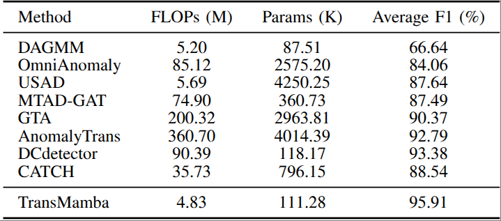
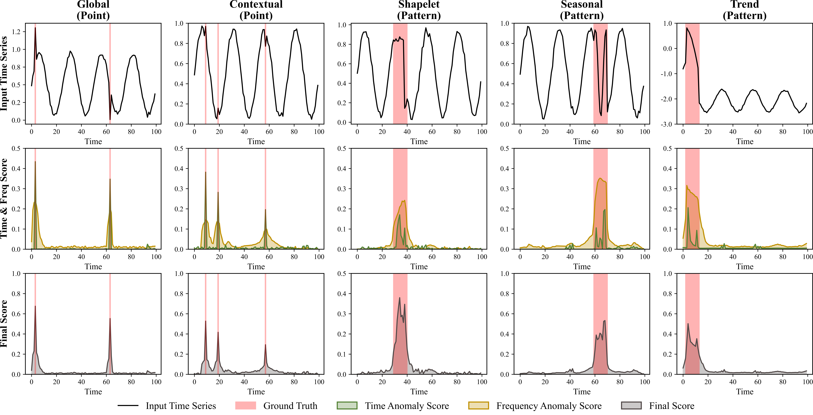

# TransMamba: Time-Frequency Discriminative Feature Learning for Multivariate Time Series Anomaly Detection


This code is the official PyTorch implementation of our paper: TransMamba: Time-Frequency Discriminative Feature Learning for Multivariate Time Series Anomaly Detection.

## Introduction

Time series anomaly detection methods based on the reconstruction frameworks have long suffered from limited discrimination, since they are single-objective frameworks that rely solely on reconstruction error for both optimization and detection, are prone to overfitting when faced with (i) abnormal noise contamination, which blurs point-wise anomaly detection and (ii) difficulties in extracting pattern-wise features. In this paper, we propose TransMamba, an unsupervised time-frequency hybrid architecture that incorporates a time-domain Transformer-based Local Variations Perception Module (LVPM) and a frequency-domain Mamba-based Global Patterns Representation Module (GPRM) to jointly learn discriminative features, achieving an superior trade-off between performance and efficiency through the complementary strengths of Transformer and Mamba.
- **Overall**: Overall architecture of TransMamba. It consists of a Transformer-based LVPM and a Mamba-based GPRM. The LVPM focuses on capturing local temporal features by modeling quantified cross-resolution variation dependencies within a contrastive paradigm. In parallel, GPRM aims to extract global patterns through time-frequency reconstruction, enhanced by a multi-granularity contrastive learning strategy.

|                      |
|:---------------------------------------------------:| 
| *Figure 1. The overall architecture of TransMamba.* |


## Main Result
Extensive experiments demonstrate that TransMamba achieves state-of-the-art performance.

|                    |
|:--------------------------------------------------:| 
| *Table 1. Overall results on real-world datasets.* |


|                       |
|:--------------------------------------------------------:| 
| *Table 2. Model complexity and performance comparison. The complexity results are measured on the PSM dataset with a batch size of 128.* |


|                                                                                                                                                                                                                                                                                                                                                           |
|:-------------------------------------------------------------------------------------------------------------------------------------------------------------------------------------------------------------------------------------------------------------------------------------------------------------------------------------------------------------------------------------------:|
| *Figure 2. Visualization of dual-domain anomaly scores from TransMamba on different types of point-wise and pattern-wise anomalies using the TODS dataset. The time anomaly score corresponds to the consistency discrepancy from the time-domain LVPM, and the frequency anomaly score is the reconstruction error from the frequency-domain GPRM. The final score is the sum of the two.* |

## Quick Start
1. Install Python 3.10.14, PyTorch 2.1.1, and Cuda 11.8.
2. Download data. You can obtain all datasets from [Google Cloud](https://drive.google.com/drive/folders/1gisthCoE-RrKJ0j3KPV7xiibhHWT9qRm?usp=sharing). **All the datasets are well pre-processed**. For the SWaT dataset, you can apply for it by following its official tutorial.
3. Train and evaluate. We provide the experiment scripts of all benchmarks under the folder `./scripts`. You can reproduce the experiment results as follows:
```bash
bash ./scripts/TransMamba/SMAP.sh
bash ./scripts/TransMamba/MSL.sh
bash ./scripts/TransMamba/PSM.sh
bash ./scripts/TransMamba/SMD.sh
bash ./scripts/TransMamba/SWaT.sh
```

## Contact
If you have any question, please contact mash@hdu.edu.cn
