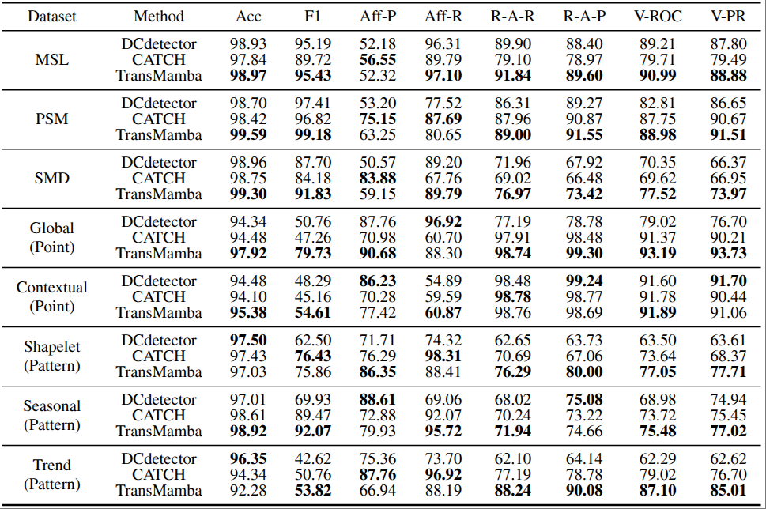

# TransMamba: Time-Frequency Discriminative Feature Learning for Multivariate Time Series Anomaly Detection

This repository contains the **official PyTorch implementation** of our paper:  
**"TransMamba: Time-Frequency Discriminative Feature Learning for Multivariate Time Series Anomaly Detection" (Submitted to ICDE 2026)**.

## Introduction

Reconstruction-based time series anomaly detection methods often suffer from limited discriminative ability because they rely solely on reconstruction error for both optimization and detection. This single-objective framework is prone to overfitting, especially when confronted with:  
(i) abnormal noise contamination, which blurs point-wise anomaly detection; and  
(ii) difficulty in extracting pattern-wise features.

In this paper, we propose **TransMamba**, an unsupervised **time-frequency hybrid architecture** that combines:  
- a **time-domain Transformer-based Local Variations Perception Module (LVPM)**, and  
- a **frequency-domain Mamba-based Global Patterns Representation Module (GPRM)**,  

to jointly learn discriminative features. By leveraging the complementary strengths of Transformer and Mamba, TransMamba achieves an excellent trade-off between performance and efficiency.

- **Architecture:** The overall architecture of TransMamba consists of two parallel modules:  
  - **LVPM:** Captures local temporal features by modeling cross-resolution variation dependencies within a contrastive learning framework.  
  - **GPRM:** Extracts global patterns through time-frequency reconstruction, enhanced with a multi-granularity contrastive learning strategy.

|  |
|:-------------------------------:| 
| *Figure 1. The overall architecture of TransMamba.* |

## Main Results

Extensive experiments demonstrate that TransMamba achieves **state-of-the-art performance** across multiple real-world and synthetic datasets.

|  |
|:-------------------------------:| 
| *Table 1. Overall results on real-world datasets.* |

|  |
|:-------------------------------------:| 
| *Table 2. Multi-metric results on synthetic datasets.* |

|  |
|:----------------------------------:| 
| *Table 3. Model complexity and performance comparison. Complexity results are measured on the PSM dataset with batch size 128.* |

|                                                                                                                                                                                                                                                                                                                                                                               |
|:---------------------------------------------------------------------------------------------------------------------------------------------------------------------------------------------------------------------------------------------------------------------------------------------------------------------------------------------------------------------------------------------------------------:|
| *Figure 2. Visualization of dual-domain anomaly scores from TransMamba on different types of point-wise and pattern-wise anomalies using the TODS dataset. The time anomaly score reflects consistency discrepancies from the time-domain LVPM, while the frequency anomaly score is based on reconstruction error from the frequency-domain GPRM. The final anomaly score is the sum of these two components.* |

## Quick Start

### 1. Environment Setup
- Install **Python 3.10.14**, **PyTorch 2.1.1**, and **CUDA 11.8**.

### 2. Download Data
- Download all datasets from [Google Drive](https://drive.google.com/drive/folders/1vD9AUGznwr3kfTsl8NkgxJQ9KMlfJowz?usp=drive_link).  
  **All datasets are pre-processed and ready to use.**
- For the **SWaT** dataset, please follow its [official tutorial](https://itrust.sutd.edu.sg/itrust-labs_datasets/dataset_info/) to obtain access.

### 3. Training & Evaluation
- We provide experiment scripts for all benchmarks under `./scripts`.  
You can reproduce the results by running the following commands:

```bash
bash ./scripts/TransMamba/SMAP.sh
bash ./scripts/TransMamba/MSL.sh
bash ./scripts/TransMamba/PSM.sh
bash ./scripts/TransMamba/SMD.sh
bash ./scripts/TransMamba/SWaT.sh
```

## Contact
If you have any question, please contact mash@hdu.edu.cn

## Acknowledgement
We appreciate the following github repos a lot for their valuable code:

https://github.com/thuml/Anomaly-Transformer

https://github.com/DAMO-DI-ML/KDD2023-DCdetector

